# Traffic-Cone Film Scanning: High-Quality Digitization on the Cheap

[Buy Cones](https://www.tindie.com/stores/dekunukem/) | [Discord](https://discord.gg/wB9mKjD2Cn) | [Table of Contents](#Table-of-Contents)

-----

Analog photography is making a resurgence, many people are shooting film again.

To view and share the photos, they need to be digitized.

Scanning using a digital camera is popular, but a conventional setup can cost [hundreds of dollars](photos/dollaz.png).

TCFS is a low-cost 3D-printable alternative that produces high-quality results at a fraction of the price.

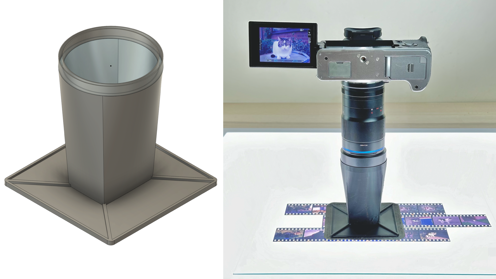

## How It Works

* Print a cone
* Attach to lens hood
* Attach to macro lens
* Film under glass
* Camera on cone, pointing straight down.
* Focus and shoot!

## Advantages

* **Low-cost**: $1 in filaments.
* **Easy setup**:
	* No tripods/copystands
	* Fixed distance, no calibration.
* **Fully Enclosed**
	* No stray lights
	* No reflection
* **Multi-format**: Subminiature, 35mm, 120, sprockets, and more!
* **Open-source**
	* Customizable parametric design
	* CCBY4.0 license.

## Table of Contents

- [Sample Scans](#samples)
- [Items Needed](#sounds-great-im-in)
- [Cone Preparation](#cone-preparation)
- [Cone Assembly](#cone-assembly)
- [Scanning Preparation](#scanning-preparation)
- [Scanning Procedures](#scanning-procedures)
- [About Newton Rings](#a-word-on-newton-rings)
- [Feedback Wanted!](#howd-it-go)
- [License Note](#license-note)

## Samples

Fuji XT4 + Laowa 65mm f/2.8

35mm

35mm Sprocket

6x6 Negative

6x6 Slide

## So What's the Catch?

While TCFS can achieve excellent results, there are a few things to keep in mind.

#### DIY Involved

* You need to be a bit handy.
* Wire a plug, use a caliper, etc. Nothing too crazy.

#### Obtaining a Cone

* One cone per film format.
* For lowest cost, print your own. Basic 3D printing experience needed.
* [Pre-made cones also available.](https://www.tindie.com/stores/dekunukem/)

#### No Magic Bullet

* TCFS can be as good as any expensive DSLR/mirrorless setup when done properly.
	* Able to get the most out of 35mm & smaller
	* Also great with medium format
	* But likely won't extract all its resolution
* For utmost quality, wet mounting/drum scans are still hard to beat.
* Main advantage is excellent scans at much lower cost, easy setup, and faster speed.

#### Feedback Wanted!

* Commodity off-the-self parts are used to reduce cost.
* However it can result in variability from person to person.
* I would love to hear about your experience!
* Get in touch [via Discord](https://discord.gg/wB9mKjD2Cn) or email: `dekuNukem&gmail.com`!

## Sounds Great, I'm In!

Let's get started! The setup involves:

* Digital Camera
* Macro Lens
* Lens Hood
* Light Table
* Flat Glass
* The Cone

## Digital Camera

Obviously, you need one of those.

Any DSLR or Mirrorless made in the past decade should be more than good enough.

No need to chase the latest and greatest. APS-C sensor is plenty.

A **swivel / tilt screen** would be nice to have, makes checking focus easier.

## Macro Lens

The quality of the scan depend largely on the lens.

For best results, I recommend:

* A proper **macro lens**
* With **internal focusing** (front element doesn't move)

---------

**Magnification Ratio** is important:

* A 1:1 (1x) ratio means the lens can project the **actual size of the subject** onto the sensor
* At 2:1 (2x), the subject can be projected **twice as big** on the sensor
* Therefore, a decent MR is useful for smaller formats (35mm and under).

-------

You can drop 4 figures on a flagship first-party lens, but for film scanning it's a bit overkill.

A popular choice is [Laowa 65mm f/2.8 2x Ultra Macro APO](https://www.venuslens.net/product/laowa-65mm-f-2-8-2x-ultra-macro-apo/):

* 2x MR
* Superb image quality
* **Ready-to-print** / [Pre-made](https://www.tindie.com/stores/dekunukem/) cones!
* Around $330

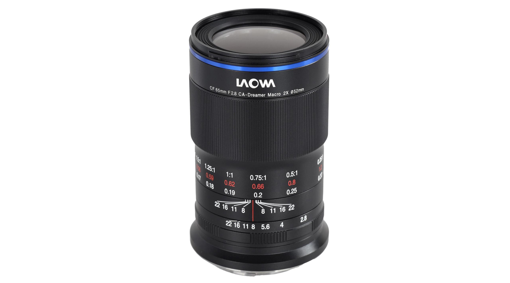

Another one is [7Artisans 60mm f/2.8 Mark II](https://7artisans.store/products/7artisans-60mm-f2-8-mark-ii-macro-lens-for-sony-e-fuji-fx-canon-eos-m-olympus-m43-nikon-z-mirrorless-cameras):

* 1x MR
* Excellent image quality
* **Ready-to-print** / [Pre-made](https://www.tindie.com/stores/dekunukem/) cones!
* Around $160

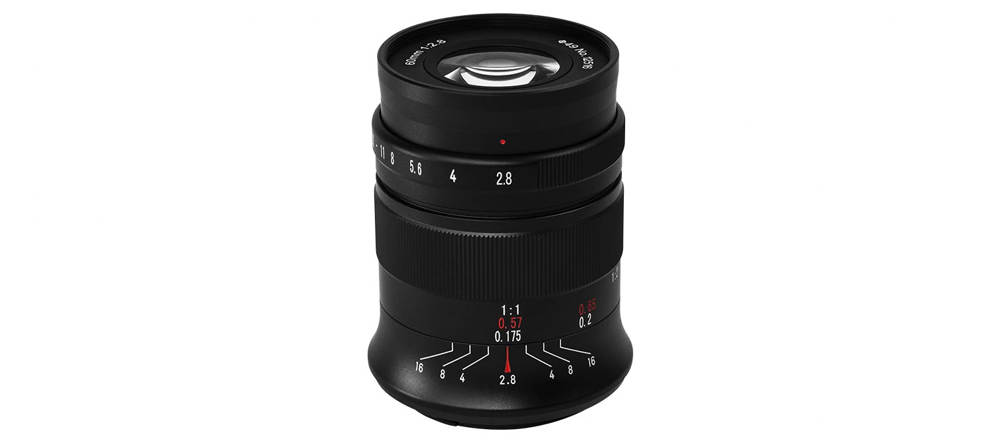

I have both, and personally I prefer the Laowa:

* Inboard aperture ring, less likely to bump into during focusing.

* Smoother focus ring, allowing finer adjustments.

* Extra magnification handy for subminiature formats (110, 126, half-frame, etc)

Anyway, can't go wrong with either. Available cheaper on aliexpress.

-----------------

Many **vintage lenses** are good candidates too, and can be even cheaper.

However, you need to do your own homework. Search `Film scan macro lens` on google.

[This article has a fairly extensive tier list](https://web.archive.org/web/20240206003914/https://www.pixl-latr.com/how-good-a-macro-lens-do-you-really-need-for-dslr-mirrorless-camera-scanning/).

## Lens Hood

We need a lens hood to attach the cone to.

* **Circular** shape
* **Fully enclosed**
* One-piece **metal** (not collapsible)
* Not too tall

Just get the cheapest from ebay or aliexpress, they are all the same. 

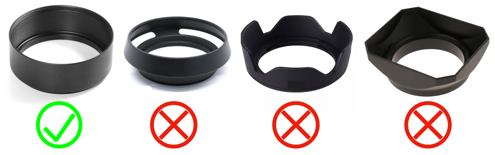

## Light Table

A bright and even light source is needed to illuminate the film from behind.

You can spend a lot on the usual suspects that sponsor Youtube videos.

Instead, I recommend getting a **LED Light Panel** for office ceilings.

They are a lot cheaper, and give you a massive area to work with.

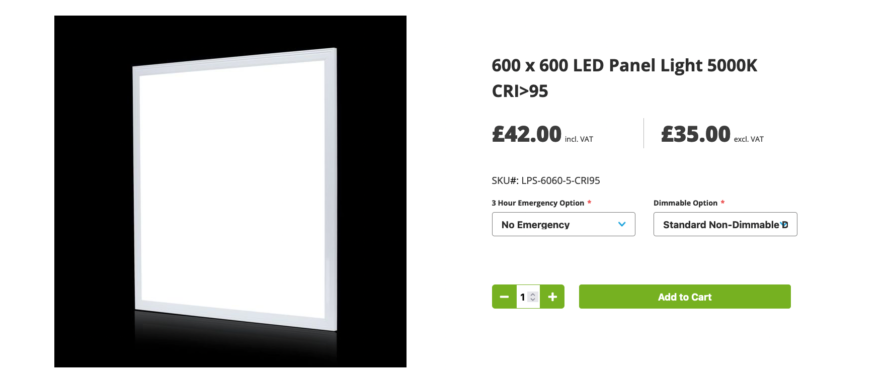

* Make sure it's **High-CRI** (>95)
* Neutral color temperature (**Around 5000K**)
* Flat matte surface finish (pretty sure they all are)
* Standard size is 600x600mm / 24x24in 
* Smaller ones available, but I like it big!

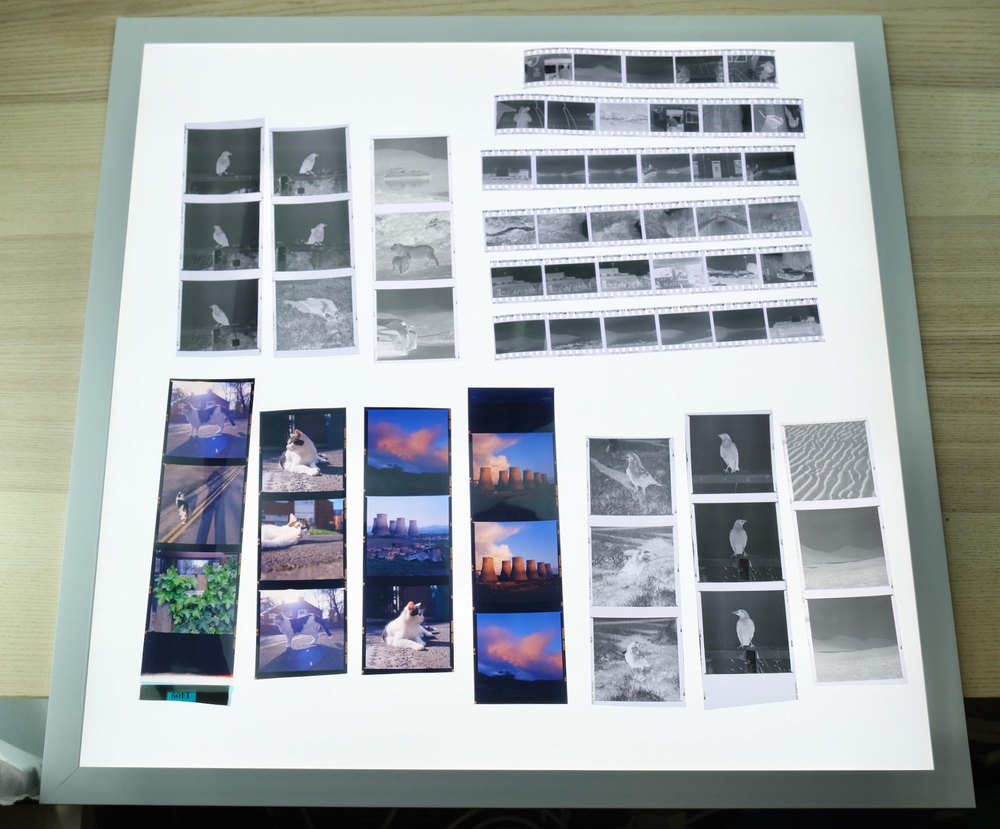

The LED panel comes with a power adapter. You need to wire a plug to it.

⚠️ ⚡ Mains voltage is involved! 

⚠️ ⚡ Make sure you know what you're doing!

⚠️ ⚡ Look up how to wire a plug in your country.

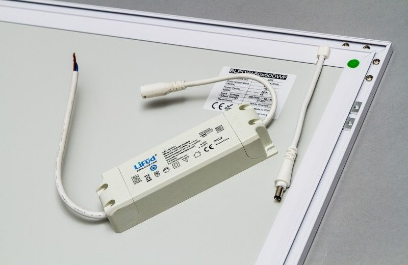

Generally:

* Brown is **LIVE**
* Blue is **NEUTRAL**
* Green/Yellow is **EARTH**

Inexpensive lever-actuated connectors like WAGO 221 is very useful for making connections without soldering.

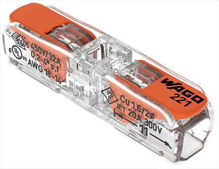

You can use a regular plug, and turn it on/off at the power strip.

Or an inline switch to be extra fancy!

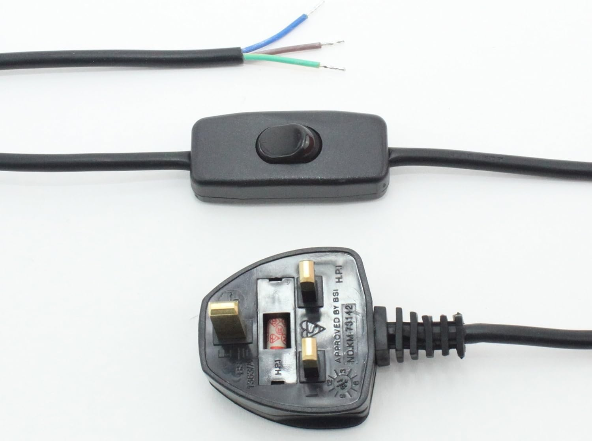

* Remember to **twist-lock** the output jack so it stays in place

## Flat Glass

We need a piece of glass to hold the film flat on the light table.

* Around 2mm thickness
* At least 8x10 in size, mine is 11x14.
* Make sure it's **glass** NOT acrylic
* I got mine from a picture frame at a thrift store

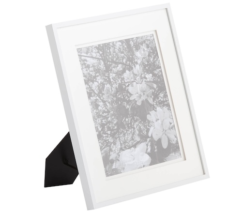

#### But what about newton rings???????

I'll talk about it later, but just know it won't be a big problem.

I suggest start with cheap plain glass, you can always upgrade to ANR glass later.

## Cone Preparation

For best results, the cone should be customized to your specific lens.

### I bought one ready-made!

Great, skip to the [Cone Assembly](#cone-assembly) section.

### I have the lens below!

* `Laowa 65mm f/2.8 2x Ultra Macro APO`
* `7Artisans 60mm f/2.8 MK II`

Great! Download a file and go to the next section.

* [35mm Full Frame](3d_models/laowa_7art_35mm_fullframe.stl?raw=true)
* [35mm Sprocket](3d_models/laowa_7art_35mm_sprocket_6x6.stl?raw=true) (using 120 adaptor on 6x6 camera)
* [645](3d_models/laowa_7art_645.stl?raw=true)
* [6x6](3d_models/laowa_7art_6x6.stl?raw=true)
* [6x7](3d_models/laowa_7art_6x7.stl?raw=true)
* [6x9](3d_models/laowa_7art_6x9.stl?raw=true)

### I'm using my own lens / I want to customize!

[Click me to learn how to customize your cone.](cone_customization.md)

## Printing the Cone

Now you have the model, time to print it!

If you don't have a 3D printer, try local library, makerspace, or online printing services.

* Use **opaque black** filament, PLA works just fine.
* Around 10-20% infill
* Very simple design, turn up the speed if you want.

2 hours later, voilà:

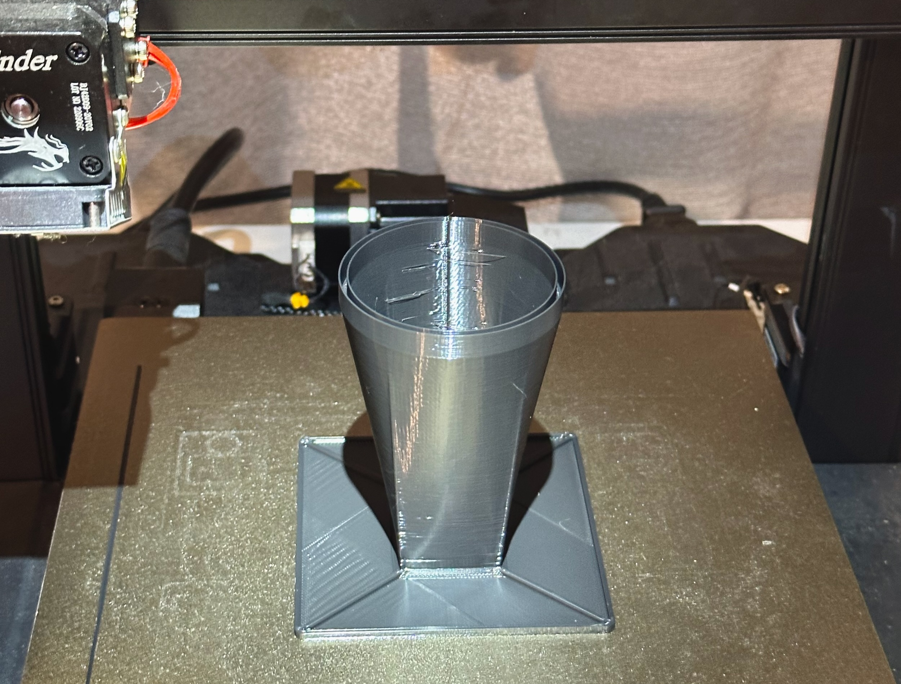

* Wait for the bed to cool down before removing.
* Double check the base is **completely flat**.
* It **must not** wobble when placed on flat surface.
* If warped, improve bed adhesion. Re-level, hairspray, raft, etc.

## Cone Assembly

* First, remove any filament whiskers/strands **near the film gate**.

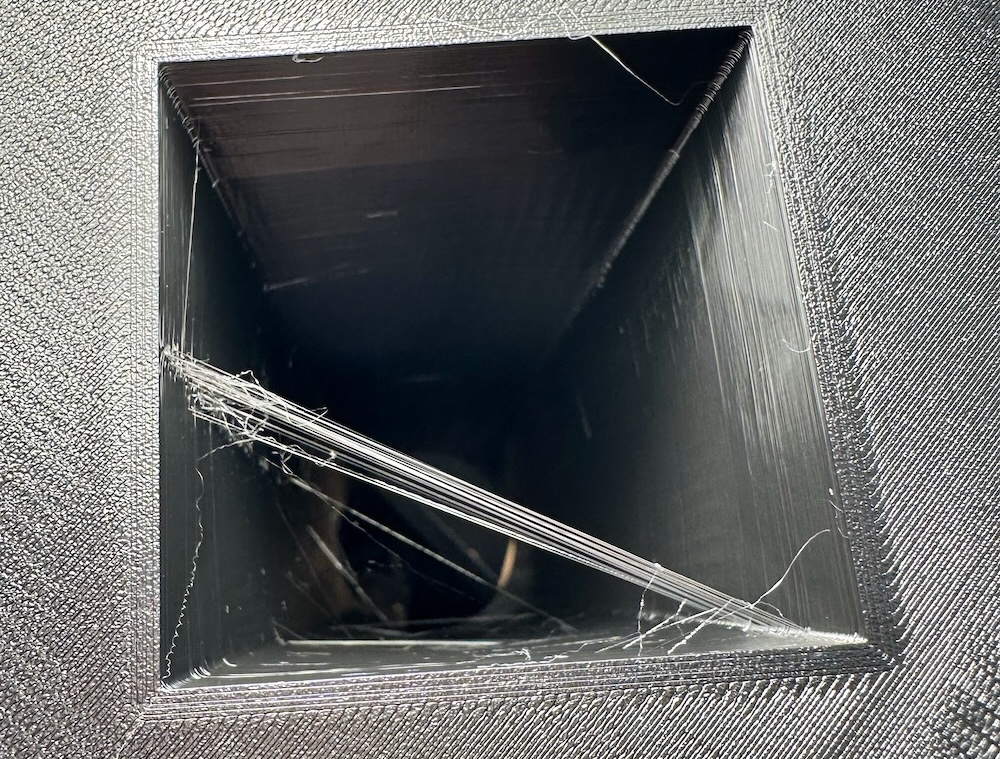

* Whiskers higher up won't show up, leave them if you want.

-----

* Put the cone on the light table
* Attach the lens hood, moderately tight

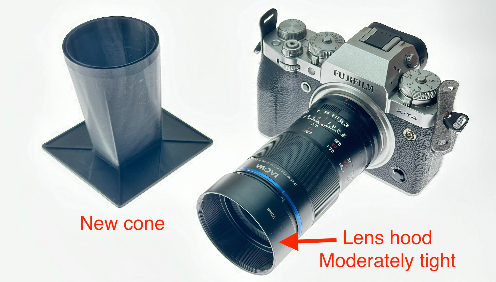

* Hover the camera just over the cone, barely touching.
* Adjust focus and position.
* Until the film gate is **parallel** with camera frame

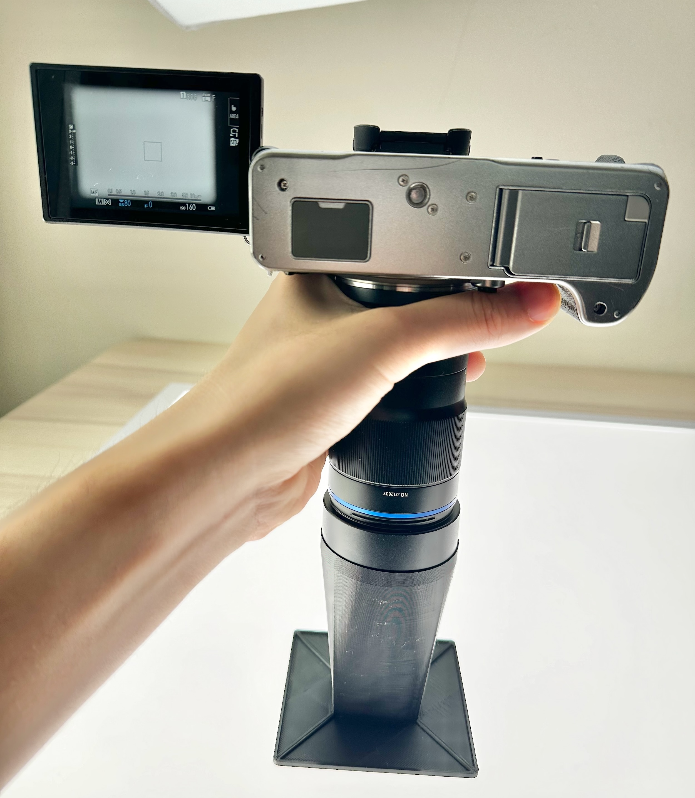

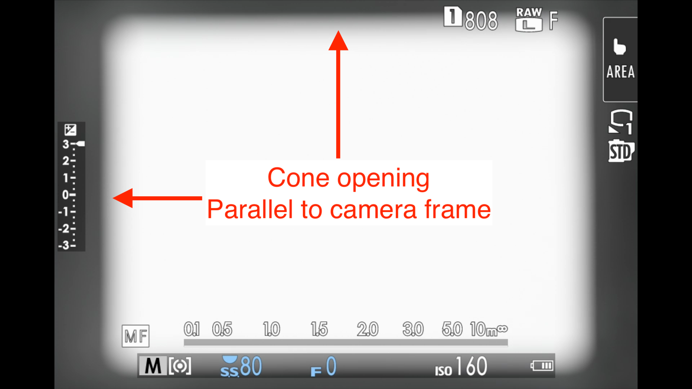

* Mark the position of the cone with paint marker, or a scratch mark.

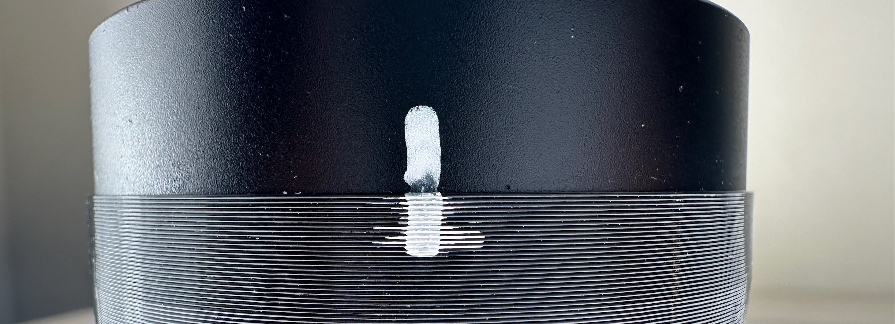

* Unscrew the lens hood
* Put the cone on a flat surface (**NOT LIGHT TABLE**)
* Ensure the mark is still aligned
* Push all the way in
* Make sure it **bottoms out** and **flat and level**

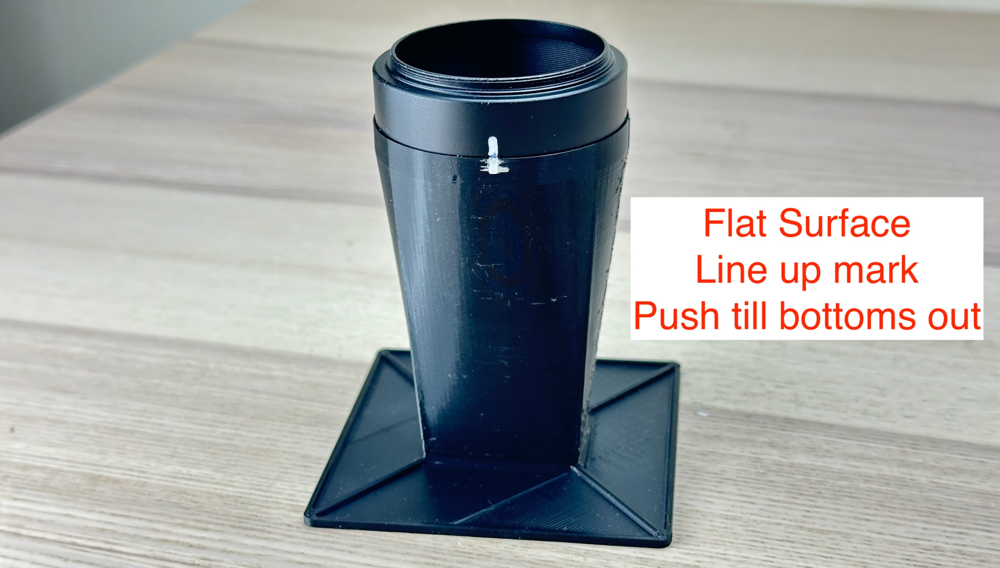

The cone should grip the lens hood tightly. 

If too loose, adjust the parameters and print a new one.

Or just put in some superglue.

## Scanning Preparation

The cone is ready! Before start scanning, we need to set up a few things.

### Light Panel

Put the light table on a flat surface.

If the power jack sticks out, let it hang off the edge. Double check it is **twist-locked**.

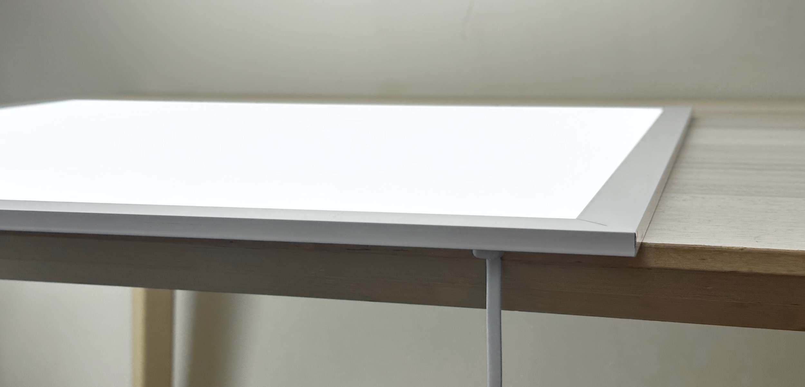

The panel should be flat and not wobble.

### White Balance

Set a **custom white balance** to your light table.

Usually involves taking a picture of the blank table. Refer to user manual.

### RAW Output

Select RAW output format for best quality, needed for most converting software.

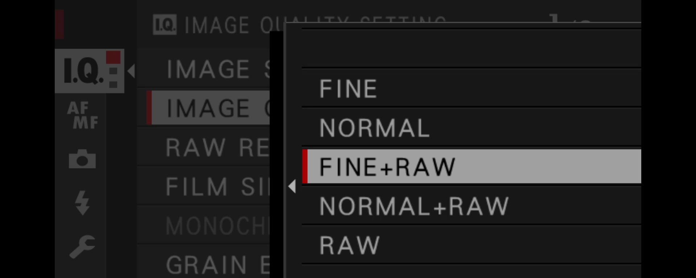

### Focus Assist

We are going to manually focus on the negative.

**Focus peaking** is essential to ensure a sharp scan.

Make sure it's on.

Color blue has good contrast against orange negatives.

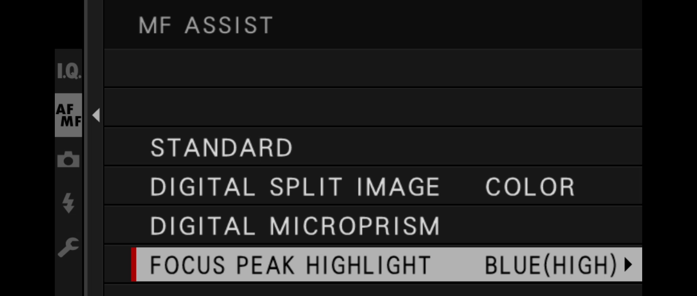

### Dust Management

We have a few potential surfaces for dust, so it is crucial to be as clean as possible.

#### WEAR GLOVES

* **DO NOT** touch film / glass with bare hands!
* I use disposable gloves, make sure its **powder-free**.
* Reusable gloves works too, but may shed lint.

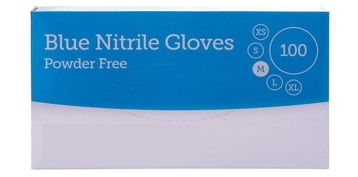

#### Wipe-down

* Before a scanning session, wipe clean the light table and glass (both sides).
* I use **Chamois Leather**. They are inexpensive, but make sure it's real (as in from an animal).
* Microfibre cloths works too, but I find them shed a lot of lint. 

## Scanning Procedures

Finally! Let's start.

* **Wear gloves**

* Wipe down the glass and light table with chamois leather

* Place film strips **emulsion side up**

	* The side that **curls up**

	* Picture/edge markings should **look mirrored**

	* Place near the **CENTER** of the light table

	* Can be the entire roll if your glass is big enough

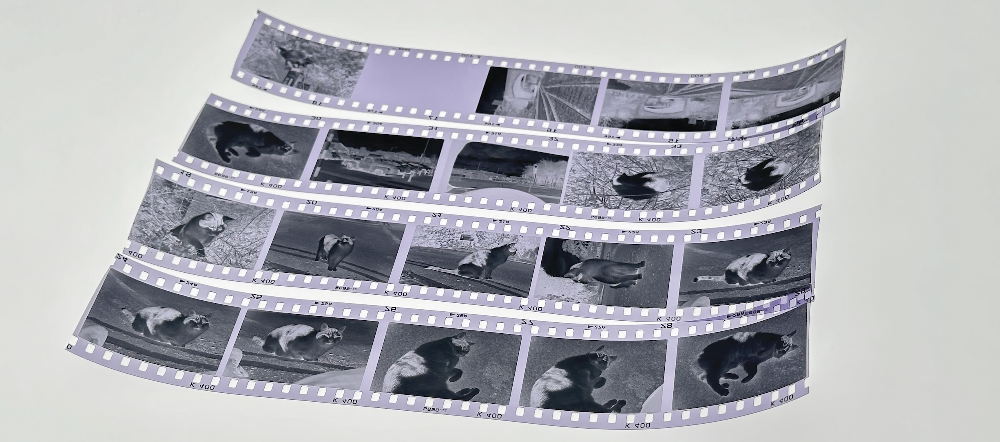

* Glass on top. Ensure **no overlapping**

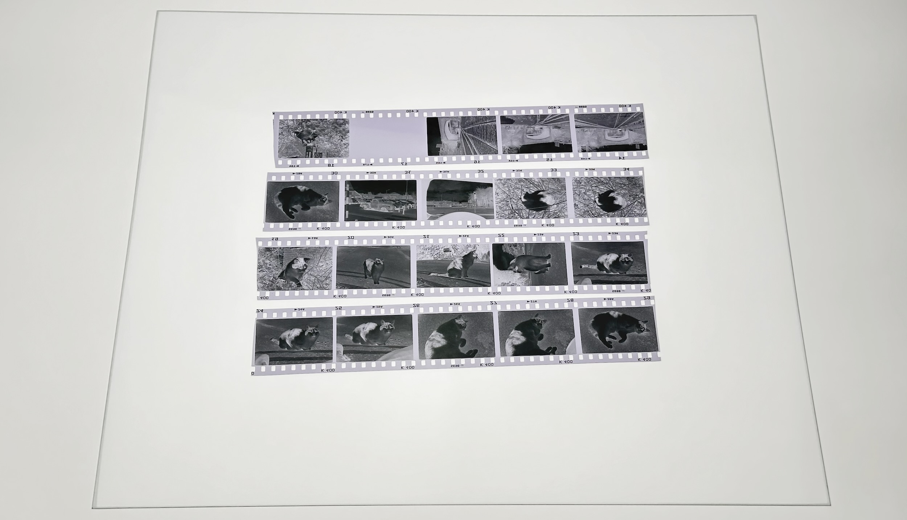

* Double check camera settings:
	* Custom white balance
	* RAW output
	* Manual focus w/ **focus peaking**
	* Lowest ISO

* Set aperture to f/8
	* Too small aperture (large f number) would soften the image due to diffraction 
	* Too large aperture (small f number) makes it difficult to focus
	* f/8 is just about right

* Use **center-weighted autoexposure**. Or fully manual if you want.

* Using a **remote release** is strongly recommended to reduce vibration and speed up the process

	* The type with 2.5mm jack are all the same, just get the cheapest one
	* You camera might also support wireless remote or phone app

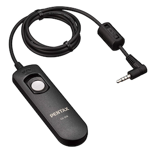

---------

* Attach cone to the camera

* Place over a negative

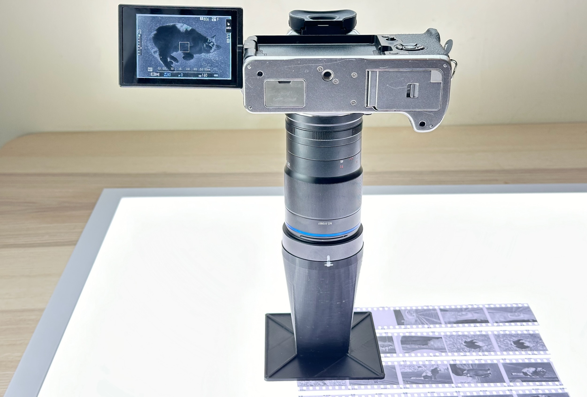

* Line up the picture

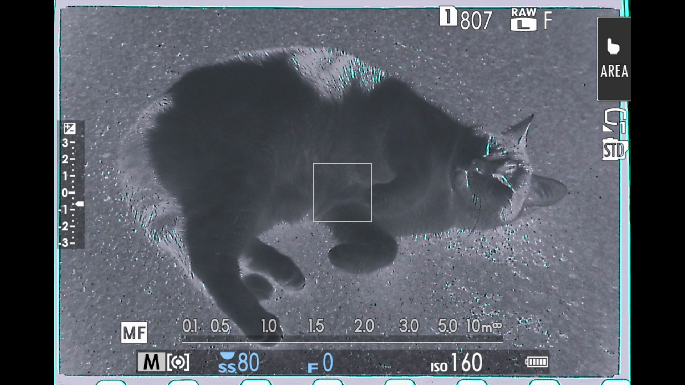

* Enter **magnified view** with focus peaking

* On Fuji X-T4, push the rear thumbwheel. Look up how to do it on yours.

* Find a sharp area on the negative

* Adjust focus ring. **Try not to apply too much downward pressure**.

* Until you achieve **maximum amount of "sparkles"**

* The tolerance is razor-thin! Tiny amount of movement is all you need.

-----

Now we are in focus!

From now on, avoid touching the camera as much as possible!

* Take a photo using remote release / remote app / self timer.

* Slide the cone around the glass for each frame

* Grab the neck of the cone, not the lens, to avoid accidentally knocking out focus.

--------

It should stay in focus for the whole session.

If you're paranoid, re-focus every time you lift the glass to put new negative in.

Definitely re-focus if left overnight. Temperature changes can cause focus drift.

## Post-Processing

Now we have high-quality scans in RAW format.

Additional processing is needed to get the final result.

We need to **invert**, **mirror**, and adjust the color of the photo.

There are a lot of guides online, so I'm not going to cover the details.

For black and white, I find it doable manually. But for color, it's much easier with a dedicated software.

Popular ones include:

* [Negative Lab Pro](https://www.negativelabpro.com/) (paid, requires Adobe Lightroom)

* [Grain2Pixel](https://grain2pixel.com) (free, requires Adobe Photoshop)

* [Darktable + Negadoctor](https://docs.darktable.org/usermanual/3.8/en/module-reference/processing-modules/negadoctor/) (free, but very fiddly last time I tried)

* [Filmomat SmartConvert](https://www.filmomat.eu/smartconvert) (paid, standalone)

-------

Personally, I use Filmomat SmartConvert to invert the negative, and macOS photos app for minor adjustments.

Zeiss Ikon Contessa 35 (Folding, 533/24), c. 1952.

Amazing how good it looks despite being over 70 years old!

## Key Points

As always, you'll get quicker with time.

To recap, those are the most important points to remember:

* **Wear gloves**
* Chamois leather wipe-down
* Emulsion side up
* White balance / RAW output / Low ISO
* f/8
* Nail the focus
* Use remote release

## A Word on Newton Rings

Newton rings are circular interference patterns caused by close proximity of two smooth surfaces.

They often appear where film touches smooth glass:

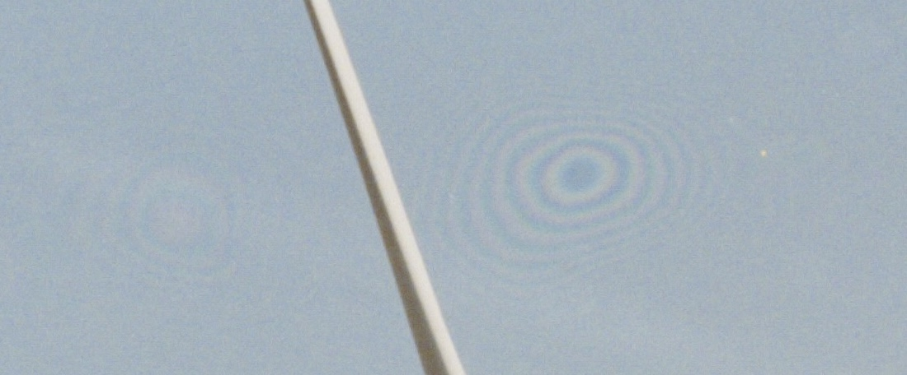

Curiously, from my experience, it almost never occurs with TCFS, even with plain glass.

I have a theory:

* We scan with emulsion side up, which is typically more matte.
* Film are also placed near the center of the light table.
* Due to its size, there might be a minuscule amount of curvature on its surface.
* Such that the film are not squished right against the glass!

#### 😡 OMG that means the film is NOT FLAT!!1!🤬y didnt u tell me eariler what a waste of time!! 

* The curvature (if any) is absolutely tiny, especially with the camera pushing down.
* Such curvature is well within the depth of field of your digital camera.
	* For 35mm, you have [2.6mm DoF](images/dof35mm.png).
	* That's the thickness of 4 credit cards, or 20 times thicker than the film itself!
	* You'll definitely notice if it's that much.
	* For 120, [DoF is 7.6mm](images/dof120.png). More than a quarter inch!

---------

* I would suggest:
	* Follow the instructions
	* Focus properly on the negative
	* Look at the result yourself and decide. The proof is in the pudding. 
* Feel free to examine my [full-size samples](./sample_scans).
* Finally, if it really bothers you, you can always get some ANR glass.
* [Useful discussion here](https://old.reddit.com/r/AnalogCommunity/comments/pex269/anr_glass_alternative_using_etched_frame_glass/).

## How'd It Go?

That's it! If you read this far, hopefully you have already made some scans, or at least interested in trying!

I would love to hear about your experience, good or bad.

As well as any comments, questions, and suggestions!

Get in touch [via Discord](https://discord.gg/wB9mKjD2Cn), or email: dekuNukem&gmail.com!

## License Note

The **scanning cone** design is under [CC BY 4.0 License](https://creativecommons.org/licenses/by/4.0/deed.en)

You can:

* Share, modify, remix, and redistribute the material, even commercially.
* **AS LONG AS** you give appropriate credit to me (dekuNukem) and [the project page](https://github.com/dekuNukem/traffic-cone-film-scanning).

The sample photos are **NOT** under CC BY 4.0 and are all rights reserved.