# Traffic-Cone Film Scanning: High-Quality Digitization on the Cheap

[Buy Cones]() | [Discord](https://discord.gg/wB9mKjD2Cn) | [Table of Contents](#Table-of-Contents)

-----

Analog photography is making a resurgence, many people are shooting film again.

To view and share the photos, they need to be digitized.

Scanning using a digital camera is popular, but a conventional setup can cost [hundreds of dollars](photos/dollaz.png).

TCFS is a low-cost 3D-printable alternative that produces high-quality results at a fraction of the price.

## How It Works

* Print a cone
* Attach to lens hood
* Attach to macro lens
* Film under glass
* Camera on cone, pointing straight down.
* Focus and shoot!

## Advantages

* **Low-cost**: $1 in filaments, $50 all-in.
* **Easy setup**: No tripods/copystands. Fixed distance, always square, no calibration.
* **Fully Enclosed**: No stray lights, no reflection.
* **Multi-format**: 110, 126, 35mm, 645, 6x6, 6x7, 6x9, sprockets, and more!
* **Open-source**: Customizable parametric design, CCBY4.0 license.

## Samples

Fuji XT4 + Laowa 65mm f/2.8

35mm

35mm in 6x6 film back

6x6 Negative

6x6 Slide

## So What's the Catch?

While I was able to achieve excellent results, there are a few things to keep in mind.

#### Getting a Cone

* Print-your-own for lowest cost, basic 3D printing knowledge needed.
* Pre-made cones are also available.
* One cone for each film format.

#### No Magic Bullet

* When done properly, the result can be as good as any expensive DSLR/mirrorless setup.
* Able to get the most out of 35mm & smaller.
* Also great with medium formats, but likely won't extract all its resolution.
* However, for utmost quality, wet mounting / drum scan is still hard to beat.
* The main advantage is excellent scans at much lower cost, easy setup, and faster speed.

#### Feedback Wanted!

* Commodity off-the-self parts are used to reduce cost.
* However it can result in variability from person to person.
* I would love to hear about your experience with TCFS!
* Get in touch [via Discord](https://discord.gg/wB9mKjD2Cn) or email: dekuNukem&gmail.com!

## Sounds Great, I'm In!

Let's get started! The setup involves:

* Macro Lens
* Lens Hood
* Light Table
* Flat Glass
* The Cone

## Macro Lens

Obviously, the quality of the scan largely depends on the lens.

For best results, I recommend:

* A proper **macro lens**
* With **internal focusing** (front element doesn't move)

---------

**Magnification Ratio** is an important factor to consider.

* A 1:1 (1x) ratio means the lens can project the **actual size of the subject** onto the sensor
* At 2:1 (2x), the subject can be projected **twice as big** on the sensor
* Therefore, a decent MR is useful for smaller formats (35mm and under).

-------

You can always drop 4 figures on a flagship first-party lens, but for film scanning it's a bit overkill.

Personally I use [Laowa 65mm f/2.8 2x Ultra Macro APO](https://www.venuslens.net/product/laowa-65mm-f-2-8-2x-ultra-macro-apo/).

* 2x MR
* Superb image quality
* **Ready-to-print** cones!
* Around $330

Another popular option is [7Artisans 60mm f/2.8 Mark II](https://7artisans.store/products/7artisans-60mm-f2-8-mark-ii-macro-lens-for-sony-e-fuji-fx-canon-eos-m-olympus-m43-nikon-z-mirrorless-cameras).

* 1x MR
* Excellent image quality
* **Ready-to-print** cones!
* Around $160

Both are fully manual and popular with film digitization.

Get them cheaper on aliexpress.

The extra magnification of laowa can be handy for subminiature formats such as 110, half-frame, or disk films.

-----------------

Many **vintage lenses** are good candidates too, and can be even cheaper.

However, you need to do your own homework. Search `Film scan macro lens` on google.

[This article has a fairly extensive tier list](https://web.archive.org/web/20240206003914/https://www.pixl-latr.com/how-good-a-macro-lens-do-you-really-need-for-dslr-mirrorless-camera-scanning/).

## Lens Hood

We need a lens hood to attach the cone to.

* Fits your lens
* **Circular** shape
* **Fully enclosed**
* One-piece **metal** (not collapsible)
* Not too tall

Just get the cheapest from ebay or aliexpress, they are all the same. 

## Light Table

A bright and even light source is needed to illuminate the film from behind.

You can spend a lot on the usual suspects that sponsor Youtube videos.

Instead, I recommend getting a **LED Light Panel** for office ceilings.

They are a lot cheaper, and give you a massive area to work with.

* Make sure it's **High-CRI** (>95)

* Neutral color temperature (**Around 5000K**)

* Flat matte surface finish (pretty sure they all are)

* Standard size is 600x600mm / 24x24in 

* Smaller ones available, but I like it big!

The LED panel comes with a power adapter. You need to wire a plug to it.

⚠️ ⚡ Mains voltage is involved! 

⚠️ ⚡ Make sure you know what you're doing!

⚠️ ⚡ Look up how to wire a plug in your country.

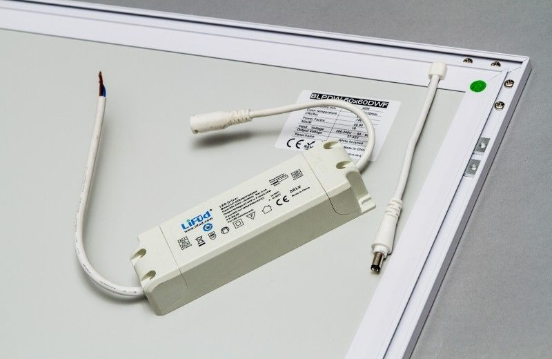

Generally:

* Brown is **LIVE**
* Blue is **NEUTRAL**
* Green/Yellow is **EARTH**

Toolless lever-actuated connectors like WAGO 221 is very useful for making connections without soldering. Very inexpensive too.

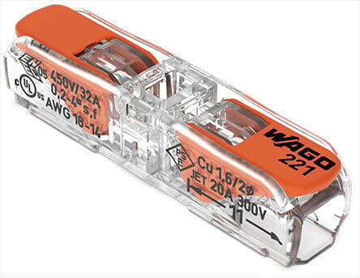

You can use a regular plug, and turn it on/off at the power strip.

Or an inline switch like this to be extra fancy!

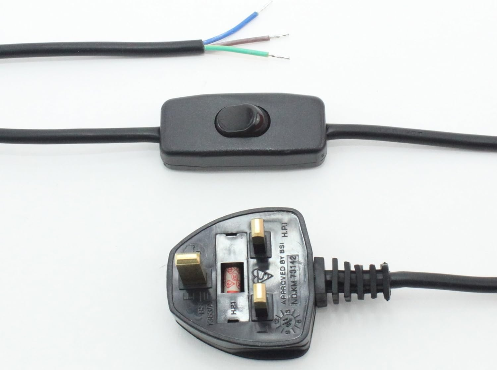

* Remember to **twist-lock** the output jack so it stays in place

## Flat Glass

We need a piece of glass to hold the film flat on the light table.

* Around 2mm thickness
* At least 8x10 in size, mine is 11x14.
* Make sure it's **glass** NOT acrylic
* I got mine from a picture frame at a thrift store

#### What about newton rings???????

We scan with emulsion side up, along with the setup I'm going to cover later, seems to helps a lot.

I suggest starting with cheap plain glass, you can always upgrade to ANR glass down the line.

## Cone Preparation

For best results, the cone should be adjusted to your specific lens / film format combo.

### I bought one ready-made!

Great, skip to the [Cone Assembly](#assembling-the-cone) section.

### I have the lens below!

* `Laowa 65mm f/2.8 2x Ultra Macro APO`
* `7Artisans 60mm f/2.8 MK II`

Great! Download a file and go to the next section.

* [35mm full frame (no sprocket)]()
* [120 645] under construction
* [120 6x6]()
* [120 6x7]()
* [120 6x9]()

sample file name: laowa_65mm_2.8_APSC-35mm.stl

### I'm using my own lens / I want to customize!

[Click me to learn how to customize your cone.](cone_customization.md)

## Printing the Cone

Now you have the model, time to print it!

If you don't have a 3D printer, try local library, makerspace, or online printing services.

* Use **opaque black** filament, PLA works just fine.
* Around 10-20% infill
* Very simple design, turn up the speed if you want.

2 hours later, voilà:

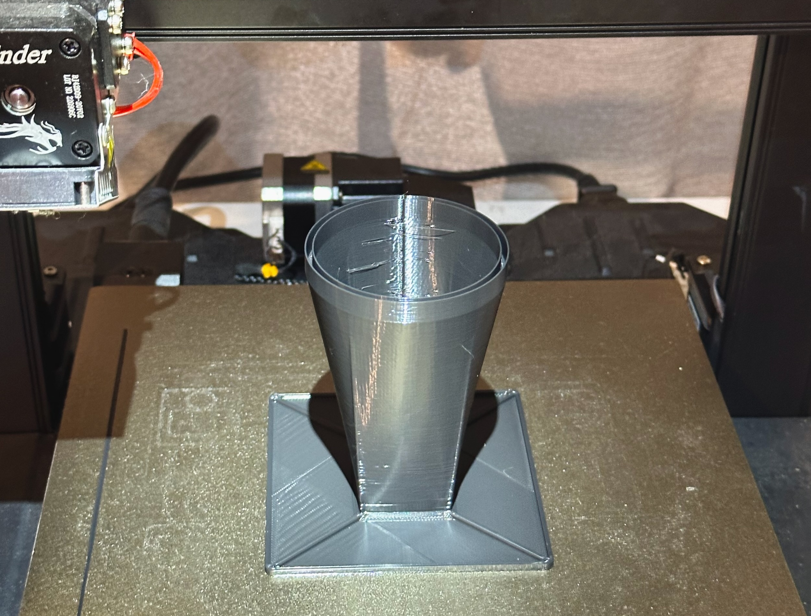

* Wait for the bed to cool down before removing.
* Double check the base is **completely flat**.
* It **must not** wobble when placed on flat surface.
* If warped, improve bed adhesion. Re-level, hairspray, raft, etc.

## Cone Assembly

* First, remove any filament whiskers/strands **near the film gate**.

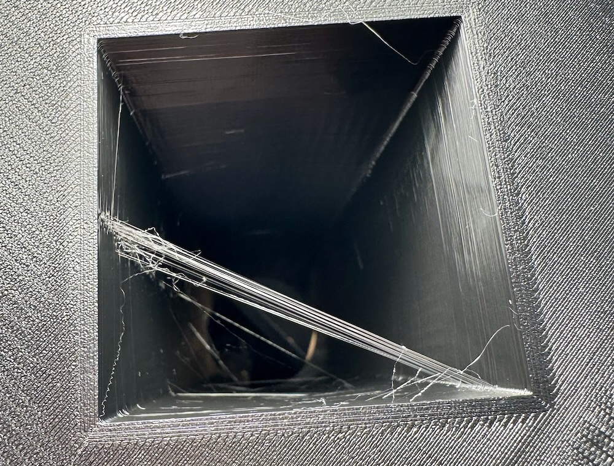

* Whiskers higher up won't show up, no need to worry about them.

-----

* Put the cone on the light table
* Attach the lens hood to your lens, moderately tight

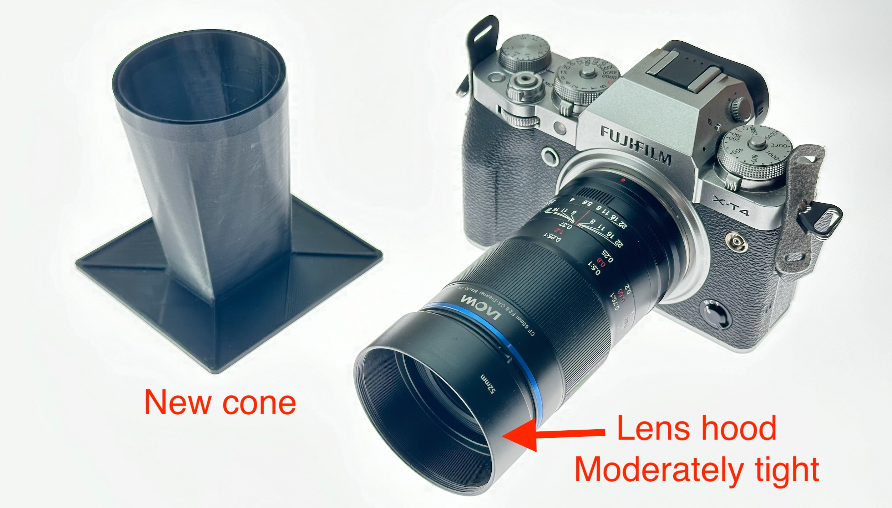

* Hover the camera just over the cone, barely touching.
* Adjust focus and position.
* Until the film gate is **parallel** with camera frame

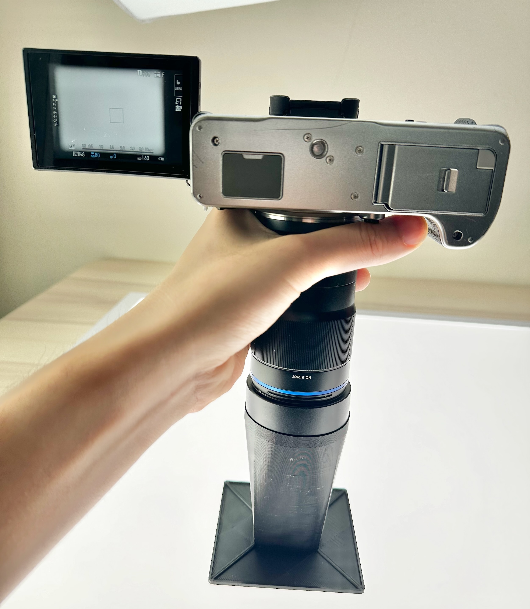

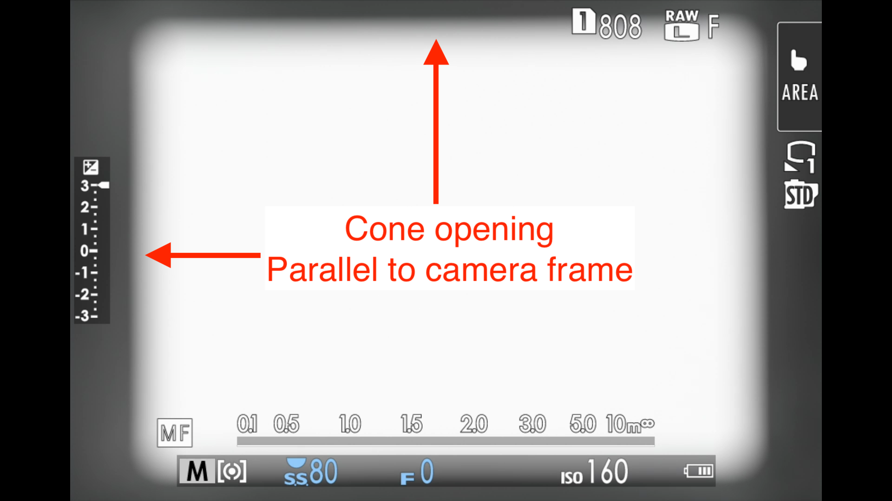

* Mark the position of the cone with paint marker, or a scratch mark.

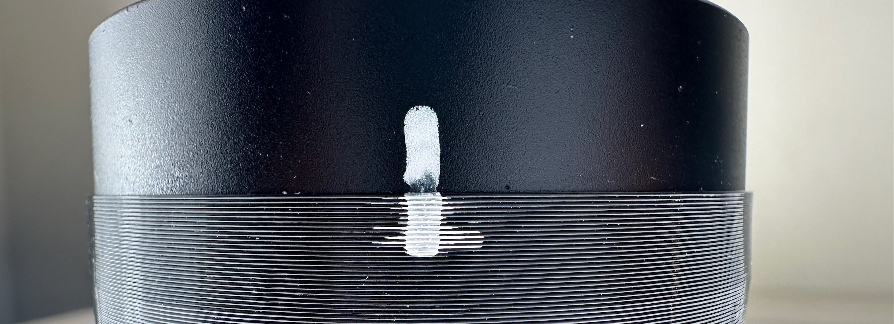

* Unscrew the lens hood
* Rest the cone on a flat surface (**NOT LIGHT TABLE**)
* Make sure the position mark is still aligned
* Push the lens hood all the way in
* Make sure it **bottoms out** and **flat and level**

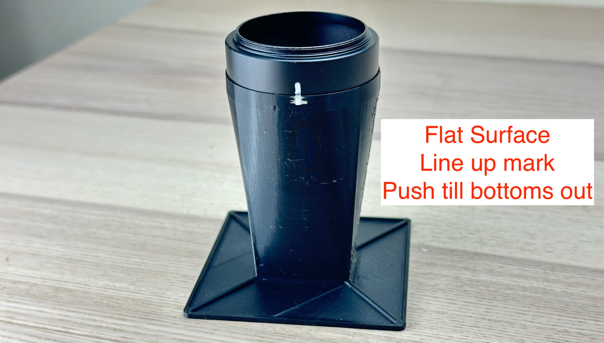

The cone should grip the lens hood tightly. 

If too loose, you can adjust the parameters and print a new one.

Or just put a few drops of superglue.

## Scanning Preparation

The cone is ready! But before start scanning, we need to set up a few things.

### Light Panel

Put the light table on a flat surface.

If the power jack sticks out, let it hang off the edge. Double check it is **twist-locked**.

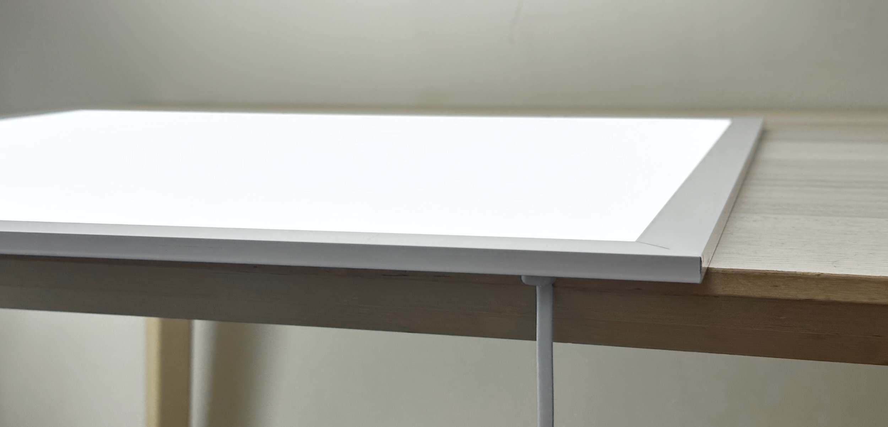

The panel should be flat and not wobble.

### White Balance

Set a **custom white balance** to your light table.

Usually involves taking a picture of the blank table. Refer to user manual.

### RAW Output

Select RAW output format for best quality, needed for most converting software.

### Focus Assist

We are going to manually focus on the negative.

**Focus peaking** is essential to ensure a sharp scan.

Make sure it's on, and blue has nice contrast with orange negatives.

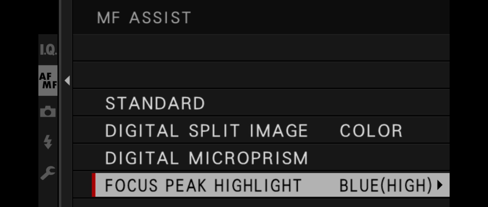

### Dust Management

We have a few potential surfaces for dust, so it is crucial to be as clean as possible.

#### WEAR GLOVES

* **DO NOT** touch film / glass with bare hands!
* I use disposable gloves, make sure its **powder-free**.
* Reusable gloves works too, but may shed lint.

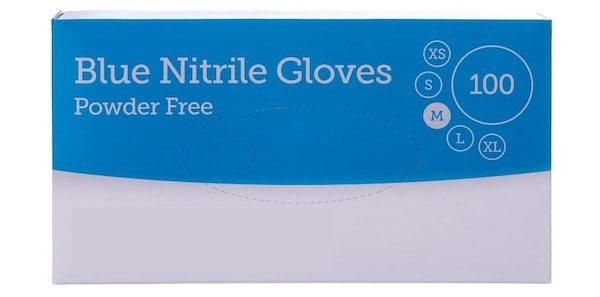

#### Wipe-down

* Before a scanning session, wipe clean the light table and glass (both sides).
* I use **Chamois Leather**. They are inexpensive, but make sure it's real.
* Microfibre cloths works too, but I find them shed a lot of lint. 

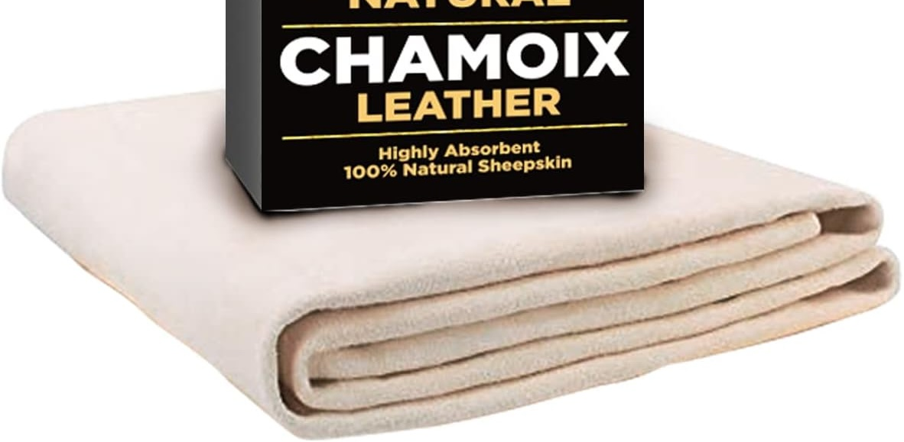

## Scanning Procedures

Finally! Let's start.

* **Wear gloves**

* Wipe down the glass and light table with chamois leather

* Place film strips **emulsion side up**

	* The correct side should **curl up**

	* Picture/frame-number should **look mirrored**

	* Place near the **CENTER** of the light table

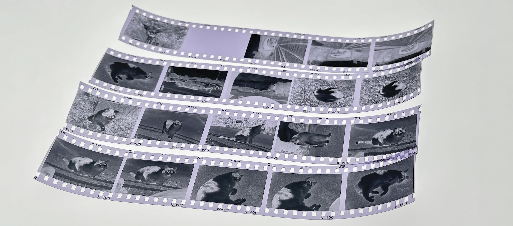

* Place glass on top. Ensure **no overlapping**

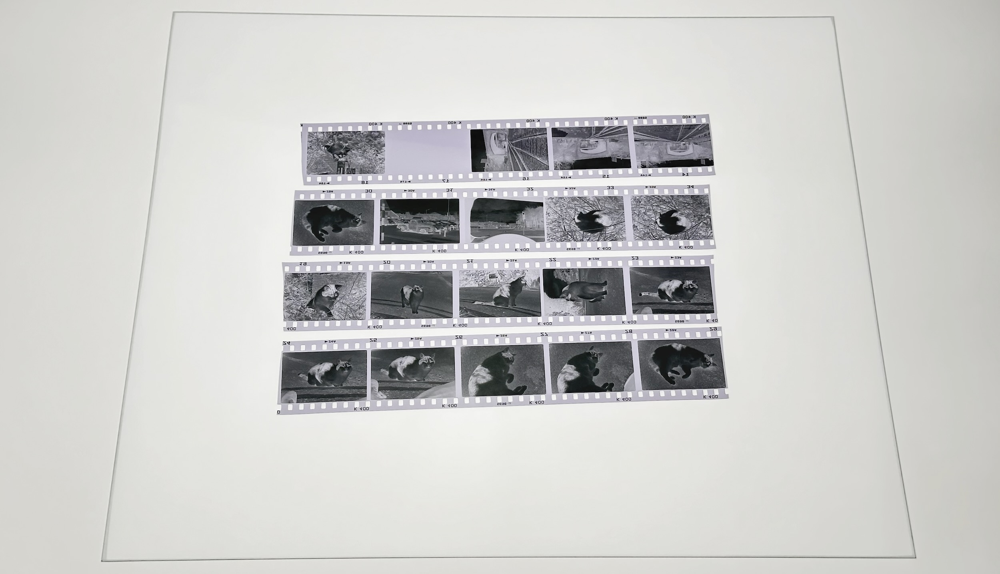

* Double check camera settings:
	
	* Custom white balance
	* RAW output
	* Manual focus w/ **focus peaking**
	* Lowest ISO

* Set aperture around f/8
	* Too small aperture (large f number) would soften the image due to diffraction 
	* Too large aperture (small f number) makes it difficult to focus
	* f/8 is just about right

* Enable **center-weighted autoexposure**.

* Seems to work pretty well, but you can go fully manual if you want.

* Using a **remote release** is strongly recommended to reduce vibration and speed up the process

	* The kind with 2.5mm jack are all the same, just get the cheapest one
	* You camera might also support wireless or phone app

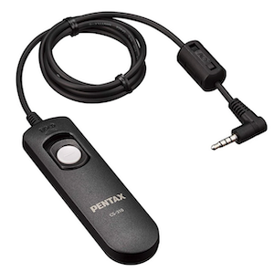

---------

* Attach cone to the camera

* Place the cone over the negative

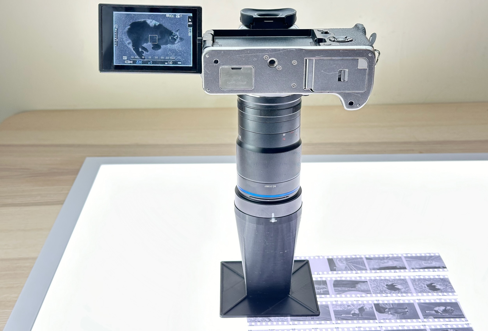

* Line up the picture

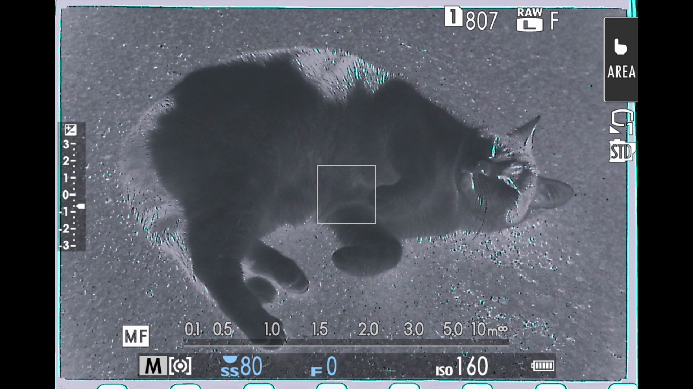

* Enter **zoomed view** with focus peaking

* On Fuji XT4 it's pushing in the back dial, look up how to do it on yours.

* Find a sharp area on the negative

* Adjust focus until you achieve **maximum amount of "sparkles"**

* The tolerance is razor-thin! Tiny amount of movement is all you need.

-----

Now we are in focus!

From now on, avoid touching the camera as much as possible!

* Use remote release / remote app / self timer, take a photo!

* Slide the cone around the glass for each photo

* Grab the neck of the cone, not the lens, to avoid accidentally knocking out focus.

--------

It should stay in focus for the whole session.

If you're paranoid, feel free to re-focus every time you remove the glass to put new negative in.

## Post-Processing

Now we have high-quality scans in RAW format.

But some processing is needed to get the best result.

We need to **invert**, **mirror**, and adjust the color of the photo.

There are a lot of guides online, so I'm not going to cover it in detail.

For black and white, I find it's doable manually. But for color, it's much easier to use a dedicated app.

Popular ones include:

* [Negative Lab Pro](https://www.negativelabpro.com/) (paid, requires Adobe Lightroom)

* [Grain2Pixel](https://grain2pixel.com) (free, requires Adobe Photoshop)

* [Darktable + Negadoctor](https://docs.darktable.org/usermanual/3.8/en/module-reference/processing-modules/negadoctor/) (free, but very fiddly last time I tried)

* [Filmomat SmartConvert](https://www.filmomat.eu/smartconvert) (paid, standalone)

-------

Personally, I use Filmomat SmartConvert to invert the negative, and macOS photos app for minor adjustments.

Final photo, click for full size.

Zeiss Ikon Contessa 35 (Folding, 533/24), made in 1952.

Amazing how good it looks despite being over 70 years old! It's my favorite point-and-shoot.

## A Word on Newton Rings

## Checklist

## License Notice

The **scanning cone** design is under [CC BY 4.0 License](https://creativecommons.org/licenses/by/4.0/deed.en)

You can:

* Share, modify, and redistribute the material, even commercially.
* **AS LONG AS** you give appropriate credit to me (dekuNukem) and this page.

Please note: The sample photos are **NOT** under CC BY 4.0 and are all rights reserved.