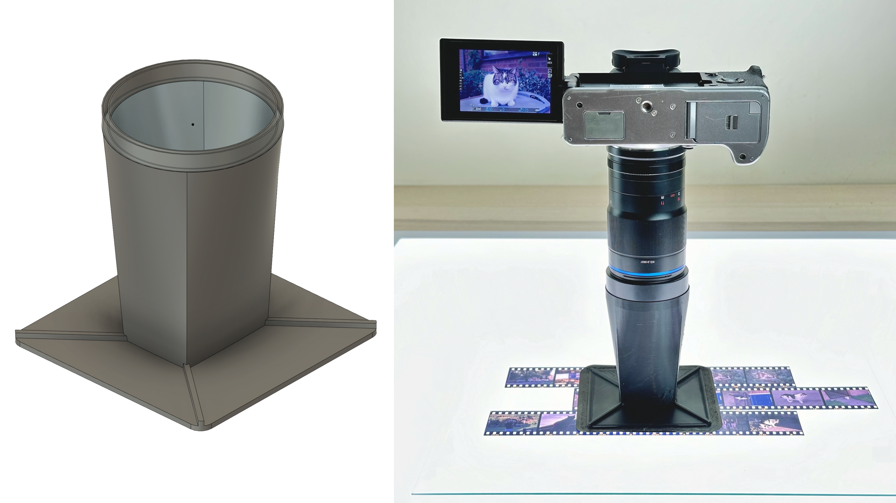
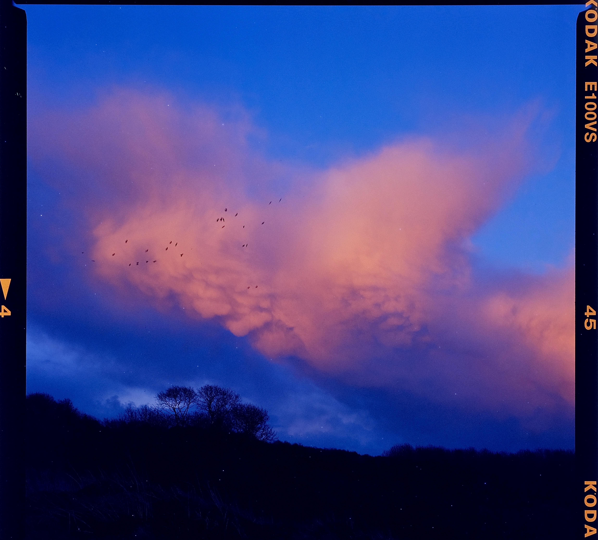
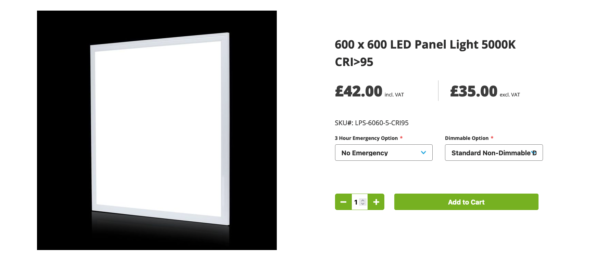
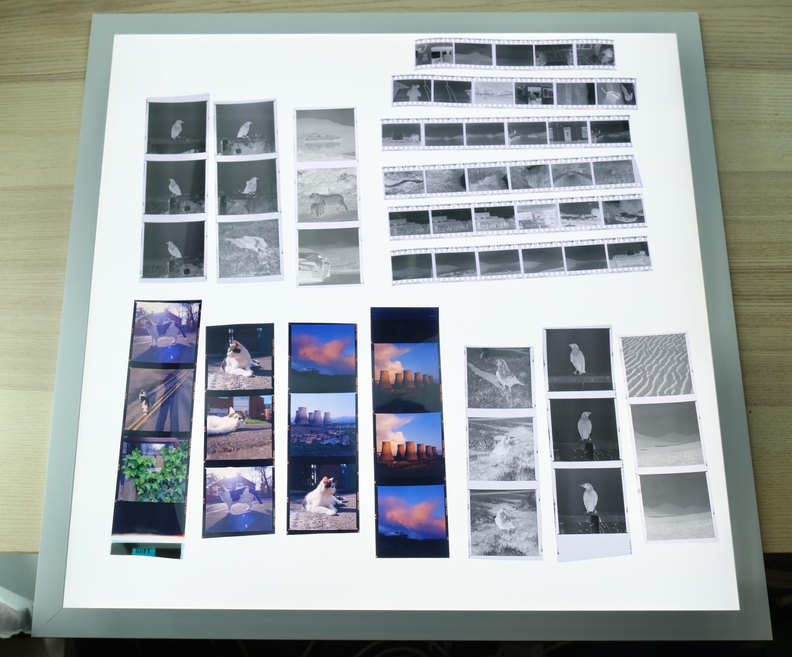
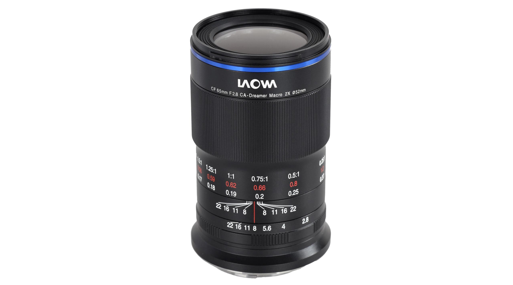
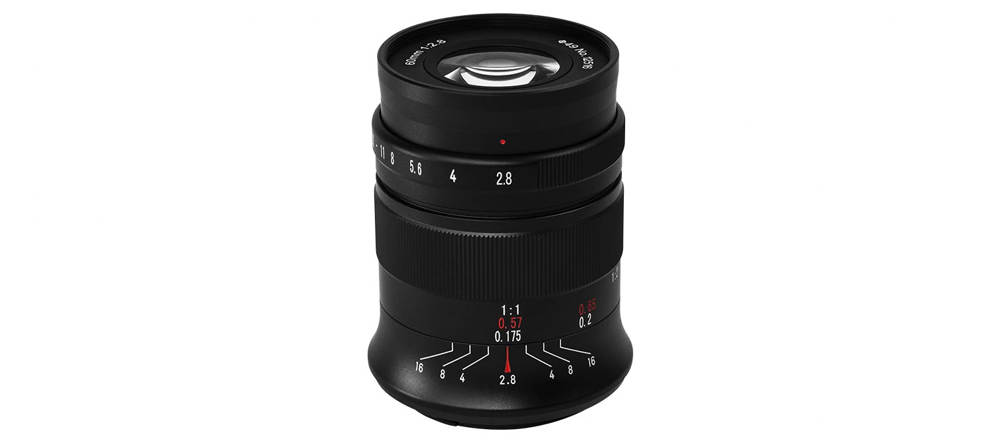
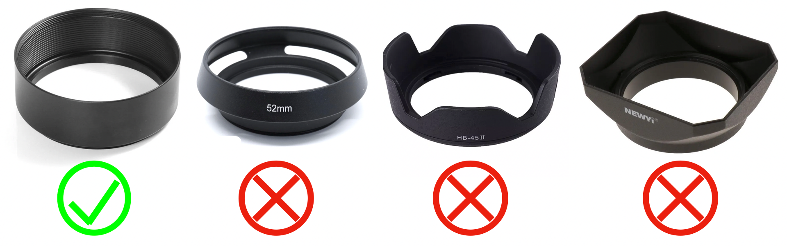
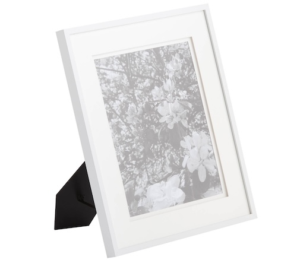

# Traffic-Cone Film Scanning: High-Quality Digitization on the Cheap

Analog photography is making a resurgence, many people are shooting film again.

To view and share the photos, they need to be digitized.

Scanning using a digital camera is popular, but a conventional setup can cost [hundreds of dollars](photos/dollaz.png).

TCFS is a low-cost 3D-printable alternative that produces high-quality results at a fraction of the price.

## How It Works

* Print a cone
* Attach to lens hood
* Lens hood on macro lens
* Film flat under glass
* Camera points straight down
* Focus and shoot!

## Advantages

* **Low cost**: $1 in filaments, $50 all-in.
* **Space-saving**: No tripods or copystands.
* **No calibration**: Fixed distance, always square, no fiddling.
* **Multi format**: 110, 126, 35mm, 645, 6x6, 6x7, 6x9, sprockets, and more!

## Samples

Fuji XT4 + Laowa 65mm f/2.8

↑ The white specks are from film expiration, not dust!!1

Anyway, as you can see, the results speak for themselves!

## So What's the Catch?

This is not a turn-key solution. You need to be a bit handy:

* Basic DIY skills: Wire a plug, using a caliper, etc.

* Access to 3D printer (Your own / local library / makerspace)

* Know basics of 3D printing (or have someone do it for you)

## Parts

Interested? Let's get started!

The setup involves:

* Light Table
* Macro Lens
* Lens Hood
* Flat Glass
* The Cone

This article assumes that you already have some 3D printing experience, so I'm not going into too much details. If this is your first time, there are a lot of resources online.

## Light Table

A bright and even light source is needed to illuminate the film from behind.

You can spend a lot on the usual suspects that sponsor Youtube videos.

Instead, I recommend getting a **LED Light Panel** for office ceilings.

They are a lot cheaper, and give you a massive area to work with.

* Make sure it's **High-CRI** (>95)

* Neutral color temperature (**Around 5000K**)

* Standard size is 600x600mm / 24x24in 

* Half-size ones available, but I like it big!

## Macro Lens

Obviously, the quality of the scan is largely dictated by the lens.

For best results, I would recommend:

* A proper **macro lens**
* With **internal focusing** (front element doesn't move)

**Magnification Ratio** is an important factor to consider.

* A 1:1 (1x) ratio means the lens can project the **actual size of the subject** onto the sensor
* At 2:1 (2x), the subject can be projected **twice as big** on the sensor
* Therefore, a decent MR is helpful for scanning smaller formats (35mm and under).

-------

You can always drop 4 figures on a flagship first-party lens, but for film scanning it's a bit overkill.

I personally use [Laowa 65mm f/2.8 2x Ultra Macro APO](https://www.venuslens.net/product/laowa-65mm-f-2-8-2x-ultra-macro-apo/).

* 2x MR
* Superb image quality
* **Ready-to-print** cones!
* Around $350

Another popular option is [7Artisans 60mm f/2.8 Mark II](https://7artisans.store/products/7artisans-60mm-f2-8-mark-ii-macro-lens-for-sony-e-fuji-fx-canon-eos-m-olympus-m43-nikon-z-mirrorless-cameras)

* 1x MR
* Excellent image quality
* Around $160

Both are fully manual and popular with film digitization.

The extra magnification of laowa can be handy for subminiature formats such as 110, 16mm, or disk films.

-----------------

Many **vintage lenses** are good candidates too, and can be even cheaper.

However, you need to do your own homework.

Search `Film scanning macro lens` on google.

[This article has a fairly extensive tier list](https://web.archive.org/web/20240206003914/https://www.pixl-latr.com/how-good-a-macro-lens-do-you-really-need-for-dslr-mirrorless-camera-scanning/).

## Lens Hood

We also need a lens hood to attach the cone to.

* Same diameter as your lens
* **Circular** shape
* **Fully enclosed**
* One-piece **metal** (not collapsible)
* Not too tall

Just get the cheapest from ebay or aliexpress, they are all the same. 

## Flat Glass

We need a piece of glass to hold the film flat on the light table.

* Around 2mm thickness
* At least 8x10 in size
* Make sure it's **glass** NOT acrylic
* I got mine from a cheap picture frame

#### But what about newton rings???????

We scan with emulsion/matte/curled side up, it helps a lot.

I suggest starting with cheap plain glass, you can always upgrade to ANR glass down the line.

## Preparing the Cone

For best results, the cone should be adjusted to your specific lens / film format combo.

### I already have the Laowa 65mm f/2.8!

Great! You're good to go.

Pick a file below and go to the next section.

* [35mm full frame (no sprocket)]()
* [120 645] under construction
* [120 6x6]()
* [120 6x7]()
* [120 6x9]()
* [35mm sprocket pano on 120 6x6]()

### I'm using my own lens / I want to customize!

[Click me to learn how to customize your cone.](cone_customization.md)

## Printing the Cone

* Use opaque **black** filament, PLA works just fine.

* Very simple model, turn up the speed if you want.

* 10% to 20% infill is plenty.

* Around 2 hours for the 35mm cone on my Ender3 S1 Pro.

## Assembling the Cone

Place the cone on the light table

attach the lens hood to your camera, moderately tight

**Loosely** rest the camera on the cone, **DO NOT** push all the way in yet!

plain table no film, adjust focus, ensure the border of the film mask is aligned with the frame

Mark the position of the cone, white marker, or just a scratch mark.

unscrew and remove the lens hood from camera

make sure the position mark is still aligned

rest the cone on a flat surface (NOT LIGHT TABLE), apply pressure to push all the way in

the cone should grip the lens hood tightly. if too loose, adjust the parameters and print a new one, or just glue it together with superglue.

## Scanning Procedures

custom white balance to the light table, take a blank photo.

Dust management

Use gloves

Carefully clean glass and light table with chamois leather, does not shed lint like microfiber. make sure real chamois. not too expensive

place negatives emulsion side up, it should be matt, flipped frame number looking down.

place glass on top.

attach cone.

place camera over the negative.

focus, focus assist, peaking with magnification absolutly essential. very littlemargin for error. look for where the assist it strongest.

aparture: very important. around F8, wide open lower image quality harder to focus. too small diffraction makes it blurry.

ISO: reduce noise, as low as possible, anything below 200 is plenty.

exposure, not too sure, center weighted autoexposure close enough.

make sure use RAW format

short self timer with remote release

change all the settings before focusing. once in focus touch as little as possible.

move the whole thing around the glass.

## Tips and Tricks

checklist

white balance correct?
ISO as small as possible

