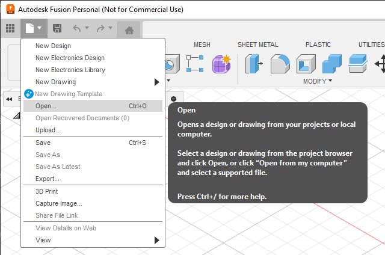
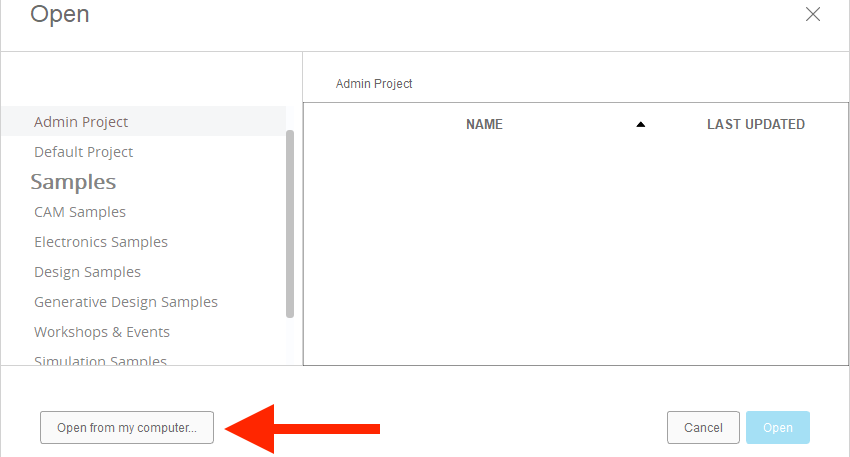
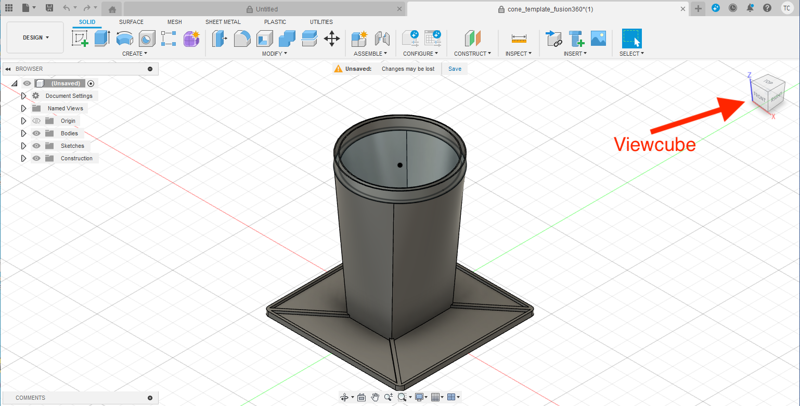
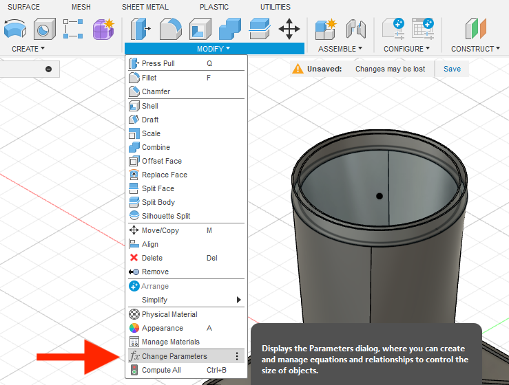
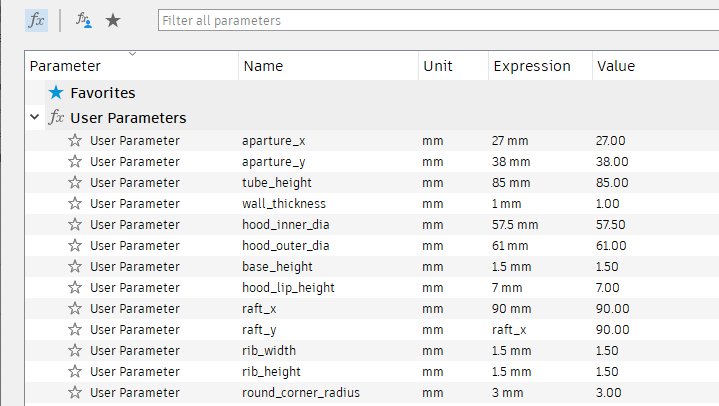
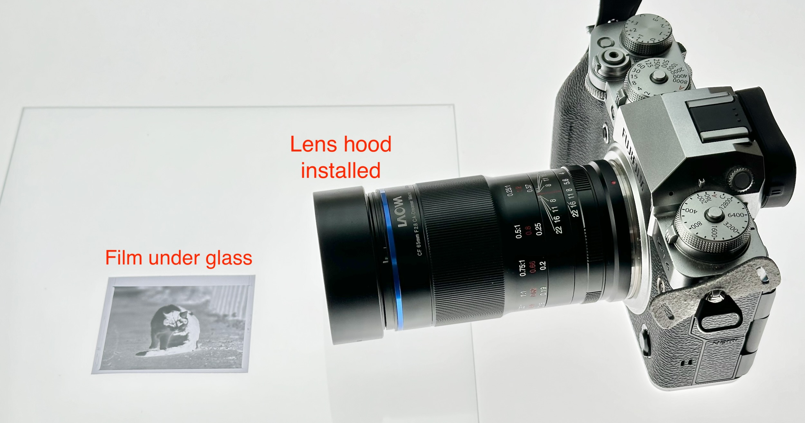
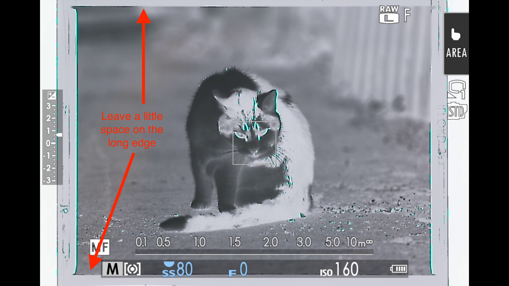
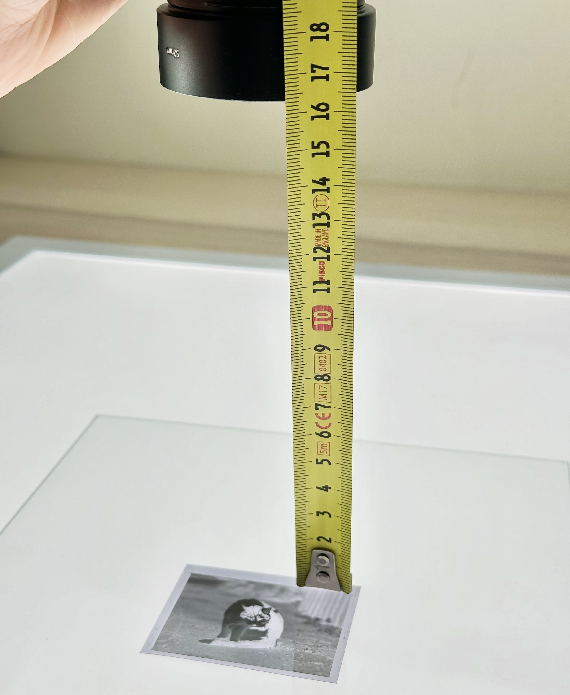
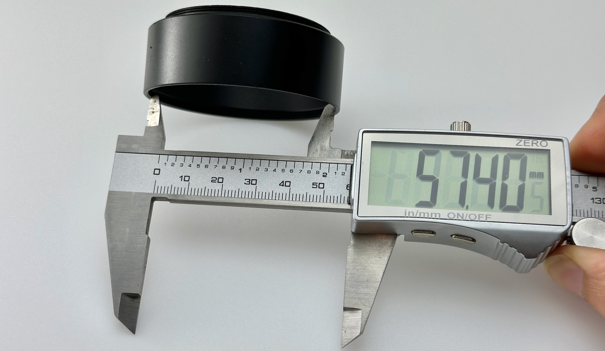
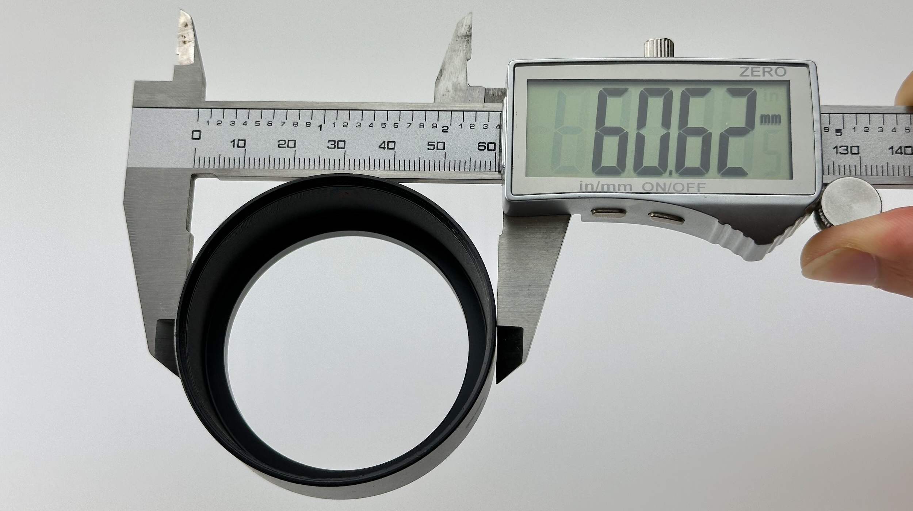

# Traffic-Cone Film Scan: Customization Guide

[Main Page](README.md)

----------

This guide shows you how to customize the cone to **your particular lens and film size**.

**Ready-to-print** cones are available for `Laowa 65mm f/2.8 2x Ultra Macro APO` and `7Artisans 60mm f/2.8 Mark II`

## Install Autodesk Fusion

Autodesk Fusion is a popular CAD software for designing 3D parts.

We're going to install the free version, customize the traffic cone, and print the result.

Go to this link:

https://www.autodesk.com/products/fusion-360/personal

Create a free personal-use account, download, and install.

* Launch Autodesk Fusion
* Click through until you see the main screen
* File icon -> Open...

* Select `Open from my computer...`

* Download the [template cone](https://github.com/dekuNukem/traffic-cone-film-scanning/raw/master/3d_models/cone_template.f3d) and select it.
* Feel free to drag the viewcube to look around.
* Click on a edge/corner/face to snap to view point.

* Click on `MODIFY` menu
* Select `Change Parameters`

* Here you can see all the parameters for this cone.

* Don't touch anything yet!
* Changing the values here will alter how the cone looks. 
* But first, we need to do some measurements.

## Measurements

In this example, I want to make a cone for **645** format with `Laowa 65mm f/2.8` and `Fuji X-T4`.

* Light panel flat on table, turn on.
* Film under glass
* Don't worry about dust yet, it's only for measurement.
* Install lens hood

* Camera on
* Point straight down
* As best as you can, adjust height and focus, until the photo:
	* Fills most of the frame, AND
	* In focus
* Leave a little space near the edge to make alignment easier 

* Hold steady
* Measure the distance from **glass to lip of lens hood** in **cm**

This will be the **height** of the cone. Around 16cm in this case.

Write it down.

----

Next, use a caliper, measure the **inner** and **outer diameter** of the hood in **mm**.

Write those down as well.

That's it! We're done.

## Parameter Adjustment

Back in Autodesk Fusion.

We can now customize the cone with the values we just measured.

