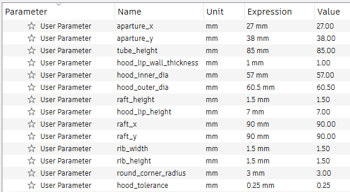

# Traffic-Cone Film Scanning: Customization Guide

[Buy Cones]() | [Main Page](README.md) | [Discord](https://discord.gg/wB9mKjD2Cn)

----------

This guide shows you how to customize the cone to **your particular lens and film size**.

**Ready-to-print** cones are available for `Laowa 65mm f/2.8 2x Ultra Macro APO` and `7Artisans 60mm f/2.8 Mark II`

## Install Autodesk Fusion

Autodesk Fusion is a popular 3D CAD software.

We're going to install the free version, customize the traffic cone, and print the result.

------

Go to this link:

https://www.autodesk.com/products/fusion-360/personal

Create a free personal-use account, download, and install.

* Launch Autodesk Fusion
* Click through until you see the main screen
* File icon -> Open...

* Select `Open from my computer...`

* Download the [template cone](https://github.com/dekuNukem/traffic-cone-film-scanning/raw/master/3d_models/cone_template.f3d) and select it.
* Feel free to drag the viewcube to look around.
* Click its edge/corner/face to snap to view point.

* Click on `MODIFY` menu
* Select `Change Parameters`

* Here you can see all the parameters for this cone.

* Don't touch anything yet!
* Changing the values here will alter how the cone looks. 
* But first, we need to do some measurements.

## Measurements

In this example, I want to make a cone for **645** format with `Laowa 65mm f/2.8` and `Fuji X-T4`.

* Light panel flat on table, turn on.
* Film under glass
* Don't worry about dust yet, it's only for measurement.
* Install lens hood

* Camera on
* Point straight down
* As best as you can, adjust height and focus, until the photo:
	* Fills most of the frame, AND
	* In focus
* Leave a little space near the edge to make alignment easier 

* Hold steady
* Measure the distance from **`glass surface`** to **`lip of lens hood`** in **mm**

This will be the **height** of the cone.

Around 16cm, or 160mm, in this case.

Write it down.

----

Next, use a caliper, measure the **inner** and **outer diameter** of the **outward facing rim** of the lens hood in **mm**.

Write those down as well.

That's it! We're done.

## Parameter Adjustment

Back in Autodesk Fusion. We can now put in the values we just measured.

Click the **number in Expression column** to change the value.

Usually, the following values need to be changed:

#### `aperture_x` and `aperture_y`

* Size of the scanning window.
* 24×36mm for 135, 60x45mm for 645, 60x90mm for 6x9, etc.
* Add extra 1mm for margin of error if you want.

#### `tube_height`

* Height of the cone you measured, in **mm**.

#### `hood_inner_dia` and `hood_outer_dia`

* Lens hood diameters you just measured
* Type in exactly **as-is**

#### `raft_x` and `raft_y`

* Size of the "base" of the cone
* Default is 90x90mm, works pretty well.
* Increase slightly for larger formats.

No need to change anything else.

---------

As you type in new values, the cone changes shape accordingly.

It is now much taller:

We can now 3D print the new cone!

* File icon -> 3D Print 

* Click on the 3D model
* Export STL file, or send directly to a slicer.

* Press `Save` icon to save a copy

Now with your very own bespoke traffic cone model, head back to [the main guide!](README.md#printing-the-cone) (`Printing the cone` section)

## License Note

The **scanning cone** design is under [CC BY 4.0 License](https://creativecommons.org/licenses/by/4.0/deed.en)

You can:

* Share, modify, remix, and redistribute the material, even commercially.
* **AS LONG AS** you give appropriate credit to me (dekuNukem) and [the project page](https://github.com/dekuNukem/traffic-cone-film-scanning).

The sample photos are **NOT** under CC BY 4.0 and are all rights reserved.