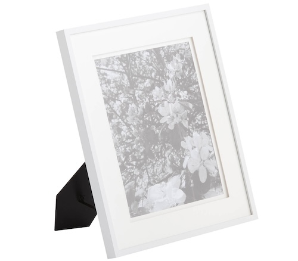

-------

Suitable for Fuji X / Sony mirrorless. Canon APSC might be slightly tighter.

### Flat Glass

This one's easy.

Get a cheap picture frame, take out the glass pane.

Bigger is better, at least 8x10.

### But what About Newton Rings????????

We'll scan with emulsion side up. You'll see.
